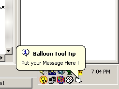



## Sys Tray and Balloon Tip code module

### Description

Had a request for this from another PSC user.

So, here it is for all to use.

One module with functions for placing Icon in SysTray and Setting a Balloon ToolTip on it.

Please look at the code snipits in "Systray Form Code.txt" file in the ZIP, thats where you need to get the rest of the code to put into the form events to make the whole thing work right! Also if you look at the example project, I also have the API and call for opening the default browser and email client when you click a textbox.

Nothing to complex, but usefull.
 
### More Info
 

             |
---                |---
**Submitted On**   |2004-11-26 11:48:12
**By**             |[Mark Mokoski](https://github.com/Planet-Source-Code/PSCIndex/blob/master/ByAuthor/mark-mokoski.md)
**Level**          |Beginner
**User Rating**    |4.9 (54 globes from 11 users)
**Compatibility**  |VB 6\.0
**Category**       |[VB function enhancement](https://github.com/Planet-Source-Code/PSCIndex/blob/master/ByCategory/vb-function-enhancement__1-25.md)
**World**          |[Visual Basic](https://github.com/Planet-Source-Code/PSCIndex/blob/master/ByWorld/visual-basic.md)
**Archive File**   |[Sys\_Tray\_a18222211272004\.zip](https://github.com/Planet-Source-Code/mark-mokoski-sys-tray-and-balloon-tip-code-module__1-57128/archive/master.zip)

